# 분산형 처리 장치(LPU/GPU/CPU) 기반 추론 네트워크 타당성 검토 및 아키텍처 제안

본 보고서는 개인 PC 수준의 유휴 연산 자원(CPU, GPU, LPU 등)을 네트워킹하여 대형 언어 모델(LLM) 및 AI 모델의 분산 추론 환경을 구축하고, 토큰(Token) 사용량 기반의 iToken 보상 체계를 결합하는 프로젝트의 기술적 실현 가능성을 검토하고 차별화된 전략을 제시합니다.

---

## 1. 개발 가능성 검토 (Feasibility Study)

제안하신 시스템은 **기술적으로 충분히 실현 가능**하며, 이미 글로벌 오픈소스 진영 및 웹3(Web3) 분야에서 유사한 하위 기술들이 구현 및 입증되고 있습니다. 시스템은 크게 세 가지 레이어로 나누어 구축할 수 있습니다.

### A. 분산 추론 및 라우팅 레이어 (Inference & Routing Layer)
* **Warm-Start vs. Cold-Start 라우팅**: 특정 모델이 이미 메모리에 로드되어 있는 노드(Warm Node)를 찾아 즉시 쿼리를 전달하는 디렉토리 서비스와, 유휴 노드 스펙(VRAM, RAM, 프로세서 유형)을 조회하여 모델을 동적으로 배포(Cold Start)하는 스케줄러 개발이 핵심입니다.
* **지연 시간(Latency) 대응**: 빠른 네트워크 환경을 가정하더라도, 분산 컴퓨팅 특성상 노드 간 데이터 통신(Prefill 단계의 Key-Value 캐시 전송, Autoregressive 단계의 토큰 전송) 오버헤드가 발생합니다. 최단 경로(Shortest-Chain) 라우팅 알고리즘과 파이프라인 병렬화(Pipeline Parallelism) 기법이 결합되어야 합니다.

### B. 하네스 / 멀티 에이전트 기반의 다중 요청 검증 (Consensus & Fault-Tolerance)
* **다중 노드 중복 요청(Redundant Execution)**: 단일 노드의 장애(Downtime), 응답 거부 또는 악의적인 오답 제출(Poisoning)을 극복하기 위해, 하나의 쿼리를 여러 노드(예: 3개 노드)에 동시에 요청하고 다수결 합의(Consensus)를 거치거나 가장 빠른 응답을 수용하는 방식입니다.
* **하네스/에이전트 조율**: 클라이언트 단의 가벼운 SDK가 이 과정을 오케스트레이션하며, 노드들의 응답 품질과 지연 시간을 통계적으로 평가하여 노드별 **신뢰도 스코어(Reputation Score)**를 갱신합니다.

### C. 분산 원장 기반 iToken 보상 레이어 (Ledger & Incentive Layer)
* **토큰 단위 보상**: 입력/출력 토큰 수를 메트릭으로 하여 자원 제공자에게 iToken을 실시간 정산합니다.
* **장부(Ledger) 시스템**: 트랜잭션 빈도가 매우 높은 LLM 추론 특성상, 매 쿼리마다 온체인(On-chain) 합의를 거치면 가스비와 속도 장벽에 부딪힙니다. 따라서 **오프체인 상태 채널(State Channels)** 또는 **Layer-2 롤업(Rollup)** 구조를 사용하여 실시간 토큰 전송을 수행하고, 주기적으로 메인 장부에 기록(Settlement)하는 구조가 필수적입니다.

---

## 2. 유사 접근 방식 및 관련 프로젝트 분석 (Prior Art)

제안하신 아이디어와 유사한 글로벌 프로젝트들의 현황과 한계점은 다음과 같습니다.

| 분류 | 프로젝트명 | 작동 방식 및 특징 | 한계점 및 제안 아이디어와의 차이 |
| :--- | :--- | :--- | :--- |
| **분산 추론 (Mesh)** | **Petals** | - BitTorrent 방식으로 대형 모델의 레이어들을 P2P 노드들이 나누어 호스팅 - 노드들이 협력하여 하나의 대형 추론을 수행 | - 느린 인터넷 속도의 노드가 병목을 유발함 - 보상 체계(토큰 이코노미)가 내장되어 있지 않음 |
| **로컬 클러스터** | **Exo** | - Apple Silicon 및 다양한 로컬 기기를 하나의 메쉬 네트워크로 묶어 로컬 추론 수행 | - 개인 단위의 사설 클러스터 구축용으로, 불특정 다수의 공개 네트워크 보상 체계 부재 |
| **자원 공유 (DePIN)** | **Nosana / Render / Akash** | - 유휴 GPU 자원을 임대하고 토큰을 지급받는 마켓플레이스 형태 | - 단순히 VM(가상머신)이나 컨테이너를 빌려주는 수준으로, 동적 쿼리 분산 처리 및 합의 검증 기능이 약함 |
| **지능 합의 (AI Chain)** | **Bittensor (TAO)** | - 서브넷별로 다양한 AI 작업(추론, 학습 등) 수행 - 검증인(Validator)이 광부(Miner)의 답변 품질을 평가하여 코인 보상 지급 | - 추론 latency 보장이 어려움 - 개별 사용자가 마이크로 세컨드 단위로 즉각적인 API 쿼리를 사용하기엔 무거움 |

---

## 3. 차별화 및 실용성 극대화 전략 (Proposal)

기존 프로젝트들의 한계를 극복하고 실용성을 극대화하기 위해 다음과 같은 **네 가지 차별화 포인트**를 제안합니다.

### 💡 차별화 1: LPU-GPU 하이브리드 파이프라인 (Hybrid Execution Model)
* **배경**: LPU(예: Groq)는 메모리 대역폭이 극단적으로 높아 출력 토큰 생성 속도(Decoding)가 매우 빠르지만 VRAM 용량이 부족합니다. 반면 고성능 GPU는 메모리가 커서 대규모 컨텍스트를 로드(Prefill)하기에 좋습니다.
* **실용적 제안**: 클라이언트의 입력 쿼리를 처리할 때, **컨텍스트 로드 및 임베딩(Prefill)은 고용량 GPU 노드**가 처리하고, **토큰 생성(Decoding)은 초고속 LPU 노드**로 라우팅하는 하이브리드 파이프라인을 구축합니다. 네트워크 레이턴시가 빠르다는 전제 하에 최고 효율의 속도를 뽑아낼 수 있습니다.

### 💡 차별화 2: 평판 기반 가변적 중복도 라우팅 (Reputation-based Dynamic Redundancy)
* **배경**: 모든 쿼리를 매번 다수의 노드에 동일하게 보내는 방식(Full Redundancy)은 자원 낭비가 심하고 비용을 3~4배 증가시킵니다.
* **실용적 제안**: 노드의 신뢰도(Reputation) 레벨에 따라 중복 전송 횟수를 동적으로 조절합니다.
  - **신뢰도 상위 노드(High Reputation)**: 단일 노드로 즉각 쿼리 처리 (비용 저렴, 빠른 속도).
  - **신뢰도 미검증 신규 노드**: 다중 노드 중복 매칭 후 합의 검증 (비용 발생, 신뢰도 테스트 목적).
  - 만약 상위 노드에서 실패나 타임아웃이 발생하면, 하네스가 즉시 백업 노드로 소프트 페일오버(Soft Failover)를 진행합니다.

### 💡 차별화 3: 초고속 토큰 단위 스트리밍 정산 (L2 State Channel Ledger)
* **배경**: 사용자와 공급자 간의 잦은 트랜잭션으로 가스 비용이 발생하면 서비스 유지가 불가능합니다.
* **실용적 제안**: 
  - **결제 채널(State Channel)** 구조를 도입하여 사용자가 노드에 연결될 때 보증금(Escrow)을 락업하고, 실시간 토큰 생성 속도에 맞춰 1 Token 단위의 마이크로 지불 영수증(Off-chain Ticket)을 공급자에게 전송합니다.
  - 세션이 종료되면 최종 누적 영수증 한 장만 메인 체인/사이드체인에 올려 가스비를 획기적으로 절감합니다.

### 💡 차별화 4: 추론 검증을 위한 Spot-Checking & Prefill-Decode Separation
* **배경**: 노드가 실제 모델을 돌리지 않고 다른 AI API(예: 무료 API) 결과를 복사-붙여넣기 하거나, 대충 쓰레기 텍스트를 반환할 위험이 있습니다.
* **실용적 제안**: 최근 제안된 **VeriLLM** 방식처럼, 전체 답변을 다 검증하는 대신 검증 노드(Validator)가 무작위로 추론 과정 중 일부 Hidden State 값이나 Prefill 데이터의 특정 구간을 재실행(Spot-checking)하여 검증 오버헤드를 1% 미만으로 억제하며 위조를 차단합니다.

---

## 4. 개념 아키텍처 및 작업 흐름 (Conceptual Architecture)

```mermaid
sequenceDiagram
    autonumber
    actor Client as 사용자 (클라이언트 API)
    participant Coord as 코디네이터 (디렉토리 서비스)
    participant Ledger as 분산 장부 (State Channel)
    participant NodeA as 노드 A (LPU - Warm)
    participant NodeB as 노드 B (GPU - Warm)
    participant Verifier as 검증 노드 (Validator)

    Client->>Coord: 쿼리 요청 (모델명: Llama-3-70B)
    Coord-->>Client: 가용 노드 리스트 반환 (A & B 매칭, 신뢰도 포함)
    Client->>Ledger: 결제 보증금(Escrow) 예치
    
    rect rgb(30, 41, 59)
        note right of Client: 하네스 기반 다중 전송 실행 (실패 대응)
        Client->>NodeA: 쿼리 전송 (Parallel Stream)
        Client->>NodeB: 쿼리 전송 (Parallel Stream)
    end

    NodeA-->>Client: 토큰 스트리밍 반환 & 서명 티켓 교환
    NodeB-->>Client: 토큰 스트리밍 반환 & 서명 티켓 교환
    
    Note over Client, NodeA: 응답 일치성 비교 (자가 합의)

    rect rgb(15, 23, 42)
        note over Verifier, Ledger: 비동기 검증 & 정산
        Verifier->>NodeA: 랜덤 스팟 체크 (Inference Proof 요구)
        NodeA-->>Verifier: 계산 증명 제출
        Verifier->>Ledger: 검증 성공 승인
        NodeA->>Ledger: 누적 서명 티켓 청구 -> iToken 출금
    end
```

---

## 5. 단계별 구현 로드맵 제안

* **Phase 1: 프로토타입 개발 (PoC)**
  - 중앙 집중식 코디네이터(서버)를 이용해 기기 간 gRPC 통신으로 쿼리를 분산 전송하는 파이프라인 구축.
  - 간단한 로컬 데이터베이스 기반 가상 장부(iToken mock)로 토큰당 차감/보상 메커니즘 테스트.
* **Phase 2: 멀티 에이전트 하네스 및 오류 복구 고도화**
  - 클라이언트 사이드 SDK 내에 다중 요청 전송 및 응답 결합(Consensus) 기능 구현.
  - 기기 응답 지연/오류 시 즉각 다른 노드로 라우팅되는 Failover 로직 완성.
* **Phase 3: 완전 분산화 및 블록체인 도입**
  - Cosmos SDK 혹은 Solana 기반의 고성능 App-Chain(앱 전용 블록체인)이나 Layer-2 솔루션을 활용하여 오프체인 지불 채널과 검증용 스마트 컨트랙트 통합.
