# Decentralized Compute Unit (iToken) Network Feasibility & Architecture Proposal (English)

> This report evaluates the technical feasibility of building a decentralized AI inference network leveraging idle compute resources (CPU, GPU) combined with a tokenized reward system (iToken), and presents our differentiation strategy.

---

## 1. Feasibility Study

The proposed system is **technically highly feasible**. The underlying technologies for peer-to-peer networking, local inference optimization, and distributed ledger bookkeeping have matured significantly. The system is divided into three layers:

### A. Distributed Inference & Routing Layer
*   **Warm-Start vs. Cold-Start Routing:** High-efficiency directory services identify nodes that already have a target model loaded in memory (Warm Nodes) to forward queries instantly. For idle nodes, a scheduler checks specifications (VRAM, RAM, GPU/CPU architecture) to load models dynamically (Cold Start).
*   **Latency Management:** To overcome P2P transmission latency, the network uses pipeline parallelism and routes queries to the shortest physical P2P paths.

### B. Harness / Multi-Agent Consensus & Fault-Tolerance
*   **Redundant Execution:** For high-security tasks or random sampling, a query can be sent to multiple nodes concurrently for semantic consensus.
*   **Reputation Score:** Client SDKs measure response latency and success rates to dynamically update each node's Reputation Score, which dictates future task routing.

### C. Ledger & Incentive Layer (iToken)
*   **Token-Based Micro-Settlement:** Nodes are paid per generated Inference Token in `iToken` (the native blockchain currency).
*   **Off-chain Payment Channels:** Due to high transaction frequencies, executing on-chain transactions for every query is impossible due to gas costs. We utilize **State Channels** where users escrow iTokens, exchange signed compute receipts off-chain, and settle on-chain only at the end of the session.

---

## 2. Competitive Analysis (Prior Art)

Several existing projects target similar concepts, but none fully implement the iToken's unique design:

| Category | Project | Architecture / Features | Limits vs. iToken |
|:---|:---|:---|:---|
| **Mesh Inference** | **Petals** | - BitTorrent-like layer sharing across P2P nodes. - Nodes collaborate to run large models. | - Slow internet nodes cause bottlenecks. - Lacks an embedded tokenomics reward system. |
| **Local Cluster** | **Exo** | - Fuses local Apple Silicon & consumer GPUs into a local mesh cluster. | - Designed for private home clusters, lacks a public volunteer reward economy. |
| **Resource Sharing** | **Nosana / Render** | - GPU rental marketplaces. | - Simple VM/container leasing, lacking native LLM routing, streaming, or verification. |
| **Decentralized AI** | **Bittensor (TAO)** | - Mining subnets for AI training and inference evaluated by validators. | - High latency; not designed for low-overhead, consumer-grade real-time API queries. |

---

## 3. Product Proposals & Differentiation

To maximize utility and outcompete existing solutions, iToken implements **four key differentiation pillars**:

### 💡 1. Decoupled Local LLM API Proxy (Simple is Best)
Rather than writing native CUDA/Metal bindings into the daemon, iToken hooks directly into existing local LLM engines (Ollama, LM Studio, Kobold.cpp) using standard OpenAI-compatible APIs (`/v1/chat/completions`). This eliminates engine complexity, provides plug-and-play setup for users, and ensures future-proof compatibility with any LLM server tool.

### 💡 2. Reputation-Based "1 Query = 1 Node" Routing (Optimistic Path)
To prevent energy waste and slash network operating costs, the default path avoids multi-node mesh consensus. It routes **1 query directly to 1 trusted node** based on reputation and collateral stake. Redundant consensus (2-Node) is reserved only for new, unverified nodes or random audit checks.

### 💡 3. Dynamic TPS & Hardware-Based Valuation
compensation scales dynamically with generation speed (TPS) relative to the network average. GPU nodes delivering high-speed responses (e.g., 50 TPS) receive premium multipliers, while slow CPU nodes are discounted and routed to asynchronous offline batch markets (e.g., bulk translation).

### 💡 4. Optimistic Challenger Slashing
Instead of running heavy, continuous verification (like VeriLLM) on every single token—which wastes immense electrical power—we use an **Optimistic Challenger Model**. Verification is 0% overhead during normal operations. If a client receives a fraudulent response, they file a challenge by staking iTokens, triggering a validator check. Cheaters lose their staked iTokens, which are awarded to the challenger.

---

## 4. Conceptual Workflows

```mermaid
sequenceDiagram
    autonumber
    actor Client as User Client
    participant Coord as Tracker (DHT Directory)
    participant Ledger as Blockchain Ledger
    participant Node as Provider Node (GPU)
    participant Verifier as Auditor (Validator Node)

    Client->>Coord: Lookup Node for Model (e.g., Llama-3-8B)
    Coord-->>Client: Return Best Node (IP, Port, Reputation)
    Client->>Ledger: Escrow iToken in State Channel
    
    rect rgb(30, 41, 59)
        note right of Client: 1-Query-1-Node Optimistic Routing
        Client->>Node: Send Query (Direct QUIC Stream)
        Node-->>Client: Stream Response Tokens & Exchange Signed Receipts
    end

    rect rgb(15, 23, 42)
        note over Verifier, Ledger: Post-Inference Audit (Dispute Only)
        Note over Client: If output is suspected fraud or below TPS threshold:
        Client->>Verifier: Challenge Node with Signed Receipt
        Verifier->>Node: Run VeriLLM Spot-Check
        alt Fraud Proven
            Verifier->>Ledger: Slash Node's Staked iTokens -> Award to Challenger
        else Honest (False Alarm)
            Verifier->>Ledger: Slash Challenger's Escrow
        end
    end
```

---

## 5. Roadmap

*   **Phase 1: PoC Prototype**
    *   Build the core Rust P2P daemon using tokio and rust-libp2p.
    *   Implement OpenAI API reverse proxy to Ollama/LM Studio.
    *   Deploy a lightweight local DB-based mock ledger for iToken micro-transactions.
*   **Phase 2: Optimistic Routing & Failovers**
    *   Implement DHT capability discovery and reputation tracking.
    *   Build the state channel micro-payment protocol.
*   **Phase 3: Production Blockchain (Substrate)**
    *   Migrate the ledger to an independent Substrate Solo Chain.
    *   Implement the Optimistic Challenger smart contracts and slashing rules.
