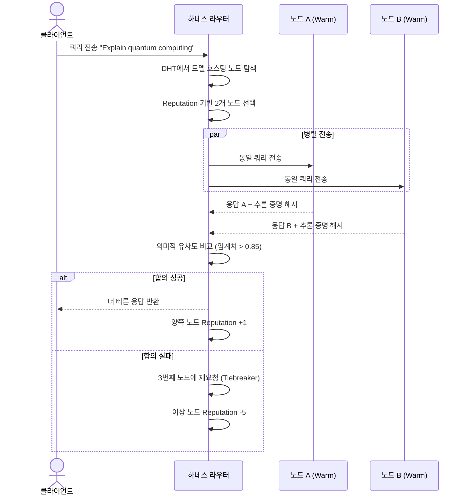
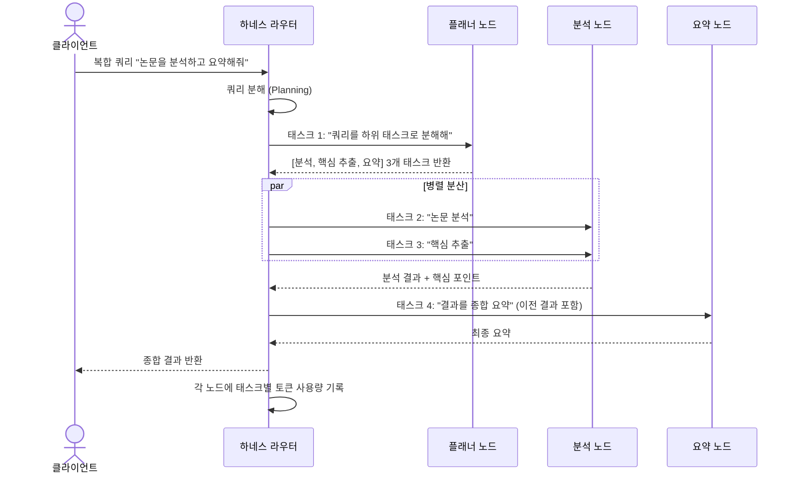

# iToken (Decentralized Processing Unit) — 상세 구현 계획서 v2

> 3개 병렬 연구(P2P 네트워킹, 범용 추론 엔진, 독립 블록체인 장부)의 결과를 종합한 최종 아키텍처 및 구현 계획

---

## 0. 핵심 설계 결정 사항

### 🔴 Python은 코어 데몬으로 사용하지 않습니다

깊은 검토 결과, **순수 Python으로 P2P 데몬을 구축하는 것은 부적합**합니다.

| 기준 | Python | Rust | Go |
|:---|:---|:---|:---|
| **바이너리 크기** | ❌ 50–150 MB (PyInstaller) | ✅ 5–10 MB | ⚠️ 15–25 MB |
| **메모리 사용량** | ❌ 가장 높음 (GC + 인터프리터) | ✅ 가장 낮음 (GC 없음) | ⚠️ 중간 (GC) |
| **GIL (Global Interpreter Lock)** | ❌ 진정한 병렬 처리 불가 | ✅ Send/Sync 타입 안전성 | ✅ goroutine |
| **libp2p 지원** | ❌ 불안정, 프로덕션 부적합 | ✅ 급성장, 고성능 | ✅ 가장 성숙 |
| **NAT Traversal** | ⚠️ 부분적 | ✅ 완전 지원 | ✅ 완전 지원 |
| **Windows 서비스** | ❌ 복잡한 래퍼 필요 | ⚠️ 가능 (`windows-service` crate) | ✅ 쉬움 |
| **크로스 컴파일** | ❌ 플랫폼별 빌드 필요 | ✅ 우수 (`cargo-zigbuild`) | ✅ 우수 (`GOOS/GOARCH`) |
| **단일 바이너리** | ❌ AV 오탐 빈발 | ✅ 네이티브 정적 링킹 | ✅ 네이티브 정적 링킹 |
| **AI/ML 생태계** | ✅ 최고 | ⚠️ 성장 중 | ❌ 약함 |

### ✅ 최종 선택: Rust 코어 데몬 + 범용 로컬 API 연동 (Ollama / LM Studio / Llama.cpp 등)

```
┌──────────────────────────────────────────────────┐
│        P2P 데몬 (Rust — tokio + rust-libp2p)     │
│  ┌──────────┐  ┌─────────────┐  ┌────────────┐  │
│  │ libp2p   │  │ Gossipsub   │  │ 원장 엔진  │  │
│  │ • QUIC   │  │ • 능력 광고 │  │ • 블록     │  │
│  │ • NAT    │  │ • 피어 점수 │  │ • 트랜잭션 │  │
│  │ • DHT    │  │ • 헬스체크  │  │ • 에스크로 │  │
│  └──────────┘  └─────────────┘  └────────────┘  │
│  ┌─────────────────────────────────────────────┐ │
│  │   하네스 라우터 (쿼리 분배 & 합의 엔진)    │ │
│  └─────────────────────────────────────────────┘ │
│  ┌─────────────────────────────────────────────┐ │
│  │   API 자동 감지 및 프록시 (Port Detector)   │ │
│  └─────────────────────────────────────────────┘ │
└──────────────────────────────┬───────────────────┘
                               │ Local HTTP / REST (OpenAI API 호환)
                               │ (예: http://localhost:11434, 1234 등)
┌──────────────────────────────▼───────────────────┐
│     외부 로컬 추론 엔진 (이미 사용자 PC에 설치된 툴)   │
│  ┌─────────────────┐ ┌─────────────┐ ┌─────────┐  │
│  │ LM Studio       │ │ Ollama      │ │vLLM     │  │
│  └─────────────────┘ └─────────────┘ └─────────┘  │
│  ┌─────────────────┐ ┌─────────────┐ ┌─────────┐  │
│  │ llama-server    │ │ Kobold.cpp  │ │기타 툴  │  │
│  └─────────────────┘ └─────────────┘ └─────────┘  │
└──────────────────────────────────────────────────┘
```

**이유 (Simple is Best):**
1. **바퀴의 재발명 방지:** GPU 가속 최적화(CUDA, Metal, Vulkan), 컨텍스트 페이징, 양자화 모델 로딩은 이미 기존 도구들(Ollama, LM Studio 등)이 완벽하게 처리하고 있습니다. 이를 iToken 안에 중복 구현할 필요가 없습니다.
2. **범용 인터페이스 연동:** 대부분의 로컬 추론 도구는 표준 OpenAI 규격의 HTTP API(`/v1/chat/completions`)를 제공하므로, iToken 데몬은 P2P 요청을 로컬 API로 넘겨주는 **안전한 역프록시(Reverse Proxy) 게이트웨이 역할**만 수행하면 됩니다.
3. **자동 인식 및 제로 설정:** 구동 시 로컬 컴퓨터의 주요 포트(11434, 1234, 8080 등)를 스캔하여 실행 중인 모델을 감지하고 DHT에 바로 등록하거나, 사용자가 특정 IP/포트(`http://192.168.0.5:12345`)를 수동 지정하기만 하면 즉시 연동됩니다.

---

## 1. 하드웨어 호환성 매트릭스

### 1.1 지원 하드웨어 및 llama.cpp 백엔드 매핑

| 하드웨어 | VRAM / 메모리 | 추론 백엔드 | 최대 모델 (Q4) | 비고 |
|:---|:---|:---|:---|:---|
| **RTX Spark** | 128 GB 통합 | CUDA | 70B+ | Blackwell SoC, ARM 기반, 통합 메모리 |
| **RTX 4090** | 24 GB | CUDA | 30–32B | 현존 최강 소비자 GPU |
| **RTX 3090** | 24 GB | CUDA | 30–32B | 가성비 우수 |
| **RTX 3080** | 10 GB | CUDA | 8B | 소규모 모델 전용 |
| **GTX 1080** | 8 GB | CUDA | 8B (Q4) | 텐서 코어 없음, 레거시 |
| **Mac Mini M4** | 32 GB 통합 | Metal | 14B | 저전력, 항시 가동 적합 |
| **Mac Mini M2 Pro** | 32 GB 통합 | Metal | 14B | 안정적 성능 |
| **Mac Pro M2 Ultra** | 192 GB 통합 | Metal | 70B+ | 초대형 모델 가능 |
| **RX 7900 XTX** | 24 GB | Vulkan | 30–32B | AMD 최상위 |
| **CPU 전용 (Intel/AMD)** | 시스템 RAM | CPU (AVX2) | RAM 의존 | 범용 폴백 |

### 1.2 모델별 메모리 요구량 (Q4_K_M 양자화 기준)

| 모델 | 파라미터 | Q4 크기 | Q8 크기 | F16 크기 |
|:---|:---|:---|:---|:---|
| Llama 3 8B | 8B | ~5 GB | ~9 GB | ~16 GB |
| Mistral 7B | 7B | ~4.5 GB | ~8 GB | ~14 GB |
| Qwen 2.5 32B | 32B | ~18 GB | ~34 GB | ~64 GB |
| Llama 3 70B | 70B | ~38 GB | ~72 GB | ~140 GB |
| Qwen 2.5 72B | 72B | ~40 GB | ~75 GB | ~144 GB |

> ⚠️ KV 캐시(컨텍스트 윈도우)용 추가 1–4 GB 필요. 장문 컨텍스트(32K–128K)는 5–20 GB 추가 필요.

### 1.3 자동 하드웨어 감지 및 백엔드 선택 알고리즘

```
function detect_best_backend():
    if platform == macOS AND has_apple_silicon():
        return METAL                          // 우선순위 1
    if has_nvidia_gpu():
        return CUDA(vram=get_nvidia_vram())   // 우선순위 2
    if has_amd_gpu():
        if platform == Linux AND has_rocm():
            return ROCM                       // 전문 AMD
        else:
            return VULKAN                     // 소비자 AMD (더 안정적)
    if has_intel_gpu():
        return SYCL or VULKAN                 // 우선순위 4
    return CPU(features=detect_avx_support()) // 범용 폴백
```

---

## 2. P2P 네트워크 아키텍처 (SETI@home 규모 확장)

### 2.1 SETI@home과의 비교 및 개선

| 항목 | SETI@home (BOINC) | iToken 네트워크 |
|:---|:---|:---|
| 아키텍처 | ❌ 클라이언트-서버 (중앙 서버 의존) | ✅ 완전 P2P (libp2p) |
| 지연 시간 | 배치 처리 (무관) | 실시간 스트리밍 (latency 중요) |
| 검증 | 중복 계산으로 비교 | VeriLLM 스팟 체킹 (1% 오버헤드) |
| 보상 | 크레딧 (실질 가치 없음) | iToken (독립 블록체인 토큰) |
| 워크로드 | CPU 전용, 독립 단위 | GPU 중심, 파이프라인 병렬 |

### 2.2 P2P 프로토콜 스택

```
┌─────────────────────────────────────────────┐
│          애플리케이션 계층                   │
│  • 쿼리 라우팅 프로토콜                     │
│  • 모델 디렉토리 동기화                     │
│  • 추론 증명 교환                           │
└──────────────────┬──────────────────────────┘
                   │
┌──────────────────▼──────────────────────────┐
│          Gossipsub v1.1+ (발행/구독)        │
│  • /dpu/capabilities/1.0.0 (노드 능력 광고) │
│  • /dpu/heartbeat/1.0.0 (헬스 체크)         │
│  • /dpu/blocks/1.0.0 (원장 블록 전파)       │
│  + 피어 점수 기반 스팸 방어                 │
└──────────────────┬──────────────────────────┘
                   │
┌──────────────────▼──────────────────────────┐
│          Kademlia DHT (분산 해시 테이블)     │
│  • XOR 메트릭 기반 O(log n) 탐색            │
│  • 노드 등록: 하드웨어 스펙 + 모델 목록     │
│  • 클라이언트 모드 (소비자 PC) / 서버 모드  │
└──────────────────┬──────────────────────────┘
                   │
┌──────────────────▼──────────────────────────┐
│          전송 계층                           │
│  ✅ QUIC (기본, 0-RTT 재연결)               │
│  • 독립 스트림 다중화 (HoL 차단 없음)       │
│  • 연결 마이그레이션 (IP 변경 시 유지)      │
│  + NAT Traversal: AutoNAT → DCUtR → Relay  │
└─────────────────────────────────────────────┘

### 2.3 NAT Traversal 전략 (가정용 네트워크 대응)

대부분의 개인 PC는 NAT/공유기 뒤에 있으므로 3단계 NAT 관통 전략이 필수적입니다:

1. **AutoNAT**: 다른 피어에게 역방향 다이얼을 요청하여 자동 NAT 상태 감지
2. **DCUtR (Direct Connection Upgrade through Relay)**: NAT 뒤의 두 노드가 릴레이를 통해 UDP 홀 펀칭으로 직접 연결 수립
3. **Circuit Relay v2**: 직접 연결 불가 시 공개 릴레이 노드를 통해 트래픽 중계 (폴백)

### 2.4 부트스트랩 및 노드 발견

```
1. 최초 접속: 하드코딩된 부트스트랩 노드 목록에 연결
2. DHT 참여: 부트스트랩 노드로부터 k-bucket 채우기
3. 능력 광고: Gossipsub으로 자신의 하드웨어 스펙 + 로드된 모델 목록 브로드캐스트
4. 피어 발견: DHT 쿼리로 특정 모델을 호스팅하는 노드 검색
5. 직접 연결: QUIC으로 추론 요청 스트림 수립
```

---

## 3. 하네스 라우팅 전략 (2-노드 합의 + 멀티에이전트 분산)

### 3.1 모드 1: 동일 쿼리 합의 (Consensus Mode — 2개 노드)



> **주의**: LLM은 비결정적(Non-deterministic)이므로 bit-for-bit 비교가 아닌 **의미적 유사도(Semantic Similarity)** 기반 합의를 사용합니다.

### 3.2 모드 2: 멀티에이전트 분산 (Multi-Agent Mode — N개 노드)



### 3.3 라우팅 결정 흐름

```
function route_query(query, mode):
    if mode == CONSENSUS:
        nodes = dht.find_nodes(model=query.model, min_count=2)
        nodes = sort_by_reputation(nodes)
        selected = nodes[:2]                     // 상위 2개
        responses = parallel_send(selected, query)
        if semantic_similarity(responses) > 0.85:
            return fastest_response(responses)
        else:
            tiebreaker = send(nodes[2], query)   // 3번째 노드
            return majority_vote([responses, tiebreaker])
    
    elif mode == MULTI_AGENT:
        subtasks = decompose_query(query)        // 쿼리 분해
        results = {}
        for task in subtasks:
            if task.depends_on:
                task.context = results[task.depends_on]
            best_node = dht.find_best_node(
                model=task.preferred_model,
                min_vram=task.estimated_vram
            )
            results[task.id] = send(best_node, task)
        return aggregate(results)
```

---

## 4. 독립형 주권 원장 (Sovereign Ledger)

### 4.1 왜 다른 코인에 의존하면 안 되는가

| 구분 | L2 롤업 (Ethereum 위) | Cosmos 체인 | Substrate Solo Chain | 자체 구축 |
|:---|:---|:---|:---|:---|
| 자체 검증인 | ❌ L1 사용 | ✅ | ✅ | ✅ |
| 자체 합의 | ❌ L1 상속 | ✅ | ✅ | ✅ |
| 부모 체인 사망 시 생존 | ❌ | ✅ | ✅ | ✅ |
| 자체 토큰 경제 | 부분적 | ✅ | ✅ | ✅ |
| 데이터 가용성 독립 | ❌ L1 의존 | ✅ | ✅ | ✅ |

> [!IMPORTANT]
> **L2 롤업은 절대 독립적이지 않습니다.** Ethereum이나 Solana 위의 L2는 부모 체인이 죽으면 함께 죽습니다. 이는 요구사항에 정면 반합니다.

### 4.2 권장 접근: Substrate Solo Chain (장기) + 경량 Rust 원장 (PoC)

**Phase 1 (PoC)**: 순수 Rust로 경량 블록체인 구현
- SHA256 블록 체이닝
- ECDSA 트랜잭션 서명/검증
- 간단한 PoS + 추론 증명 합의

**Phase 3 (프로덕션)**: Substrate Solo Chain 마이그레이션
- Bittensor(TAO)가 Substrate 기반으로 성공한 선례
- Forkless Wasm 업그레이드 (하드포크 없이 체인 업그레이드)
- Rust 네이티브 → GPU/컴퓨트 워크로드와 자연스러운 통합
- Polkadot과 **무관하게** 독립 운영 가능 (Solo Chain 모드)

### 4.3 추론 검증 합의 메커니즘 (VeriLLM 및 하이브리드 검증)

LLM 추론은 실행 환경에 따라 미세한 수치적 비결정성이 존재하므로 단순 바이트 단위 비교(Bit-for-bit match)가 불가능하며, 악의적 노드가 연산을 우회하여 Hidden State를 위조(Forgery)할 위험이 있습니다. iToken 네트워크는 이를 방지하기 위해 **VeriLLM의 수학적 한계 보완책**과 **하이브리드 검증 기법**을 결합한 계층적 검증 체계를 설계합니다.

#### 1. 비결정성(Numerical Drift) 극복 방식
동일 프롬프트에 대해 Temperature = 0(Greedy Decoding)으로 설정하더라도, 하드웨어 아키텍처(NVIDIA CUDA vs Apple Metal vs CPU)와 컴파일러 최적화 차이로 부동소수점 연산 순서가 미세하게 달라집니다.
*   **수치적 불일치 허용 (Noise-Tolerant Comparison):** VeriLLM은 비교 대상 Hidden State 텐서의 각 원소를 IEEE 754 부동소수점의 **부호(Sign), 지수(Exponent), 가수(Mantissa)** 성분으로 통계 분해합니다.
*   **통계적 임계값 적용:** 하드웨어 이종성으로 인한 자연스러운 오차(Benign Drift) 범위는 지수 불일치율 및 가수 편차의 임계값 이내로 허용하고, 모델 위조나 양자화 단축(예: FP16으로 속이고 INT4 실행) 등 악의적 편차(Malicious Deviation)는 임계값을 초과하여 불합격 판정을 받도록 설계합니다.

#### 2. Hidden State 위조(Prefill-Forgery) 방어 방식
가장 연산량이 많은 순차 생성(Autoregressive Decoding) 단계를 건너뛰고, 정답을 임의로 적어둔 뒤 한 번의 단일 패스(Single-Pass Prefill) 연산만으로 Hidden State를 통째로 얻어내 제출하는 **프리필 위조 공격(Prefill-Forgery Attack)**을 방어합니다.
*   **조건부 확률 검증 (Conditional Probability Check):** 검증자는 특정 시점의 Hidden State로부터 출력된 다음 토큰의 조건부 확률 분포(Greedy Token)가 제출된 텍스트 흐름과 수학적으로 일치하는지 검사합니다. 임의로 프리필하여 끼워 맞춘 Hidden State는 이 오토레그레시브 조건부 확률 인과관계를 유지할 수 없어 적발됩니다.
*   **무작위 슬롯 검증 (VRF Commit-Reveal):** 추론자는 연산 로그의 Merkle Root를 먼저 퍼블릭 채널에 박제(Commit)하고, 커밋 완료 후 온체인 난수(VRF)로 선정된 무작위 인덱스의 Hidden State만 사후에 공개(Reveal)하여 검증받으므로 타겟형 위조가 불가능합니다.

#### 3. iToken Heterogeneous 하이브리드 검증 모델 (실무적 보완책)
개인용 RTX, Mac Mini, CPU 등이 혼재된 대규모 분산 환경에서 모든 검증 노드가 무거운 모델을 VRAM에 적재하고 스팟 체킹을 하는 것은 비효율적입니다. 따라서 검증 오버헤드를 줄이기 위한 하이브리드 모델을 구현합니다.

```
┌───────────────────────────────────────────────────────────────────────┐
│              [ iToken 계층형 하이브리드 검증 시스템 ]                    │
├───────────────────────────────────────────────────────────────────────┤
│  1단계: 출력 수준 의미 합의 (Semantic-level Agreement)               │
│  • 동일 쿼리에 대해 2개 노드 분산 실행 후, 경량 임베딩 모델(예:       │
│    MiniLM)로 의미 유사도(Cosine Similarity >= 0.85) 비교.             │
│    (가장 가볍고 즉각적이며, 검증자가 큰 모델을 로드할 필요 없음)        │
├───────────────────────────────────────────────────────────────────────┤
│  2단계: 출력물 그린 워터마킹 (Green Watermark Verification)           │
│  • 생성 단계에서 특정 Seed 기반으로 확률 분포를 미세하게 왜곡 삽입.   │
│  • 검증자는 모델 연산 없이 워터마크 키만 대조해 정직한 추론 유무 판별.│
├───────────────────────────────────────────────────────────────────────┤
│  3단계: 상시 챌린지 쿼리 (Challenge-Response Benchmarking)            │
│  • 검증 노드가 이미 Hidden State와 토큰 정답을 알고 있는 테스트 쿼리를│
│    일반 유저 쿼리에 무작위로 섞어 발송. 오답 시 즉시 담보 슬래싱.     │
├───────────────────────────────────────────────────────────────────────┤
│  4단계: VeriLLM + Optimistic Fraud Proof (최종 분쟁 조정 및 판결)     │
│  • 상기 단계에서 부정 의혹 제기 시, VRF 스팟 체킹 및 이분법 프로토콜을│
│    통해 온체인에서 최종 사기 노드를 판정하고 즉시 담보 슬래싱 실행.  │
└───────────────────────────────────────────────────────────────────────┘
```

### 4.4 "iToken" 자산 정의 및 시장 평가 메커니즘

본 시스템의 핵심 자산이자 통화인 **iToken(Intelligence Token)**은 단순한 유틸리티 코인을 넘어, 분산 네트워크상에서 생성된 **지능의 가치(Inference)와 속도(Compute Speed)를 측정하고 교환하는 단일 화폐이자 자산**입니다.

#### 1. iToken의 정의 및 역할
*   **iToken (네이티브 화폐):** iToken 체인의 기본 장부 통화이자 자산 단위입니다. 하드웨어 제공자가 텍스트 토큰을 생성해 공급하면 iToken이 발행(채굴)되고, 사용자가 추론 쿼리를 던질 때 iToken이 소모됩니다.
*   **지불의 경제적 균형:** 노드는 쿼리를 받기 위해 iToken을 반드시 에스크로에 **담보(Staking)**해야 하며, 사기나 기형적인 추론 속도 제공 시 담보가 즉시 몰수(Slashing)됩니다.

#### 2. 속도(TPS) 및 하드웨어 차등 평가 공식
CPU 기반의 느린 추론과 GPU 기반의 실시간 고성능 추론은 가치가 달라야 합니다. iToken의 채굴 및 지급 가치는 토큰 생성량에 모델의 품질 가중치($TQW$)와 **전송 속도 가중치($TPS\text{ Multiplier}$)**를 곱해 결정됩니다.

$$\text{iToken Reward} = \text{Generated Tokens} \times TQW_{M, Q} \times \text{Speed Multiplier}(TPS)$$
*   **$TQW_{M, Q}$ (토큰 품질 가중치 - 지능 디플레이션 대응):** 모델 지능 수준($M$)과 양자화($Q$)에 근거해 시장이 평가한 기본 모델 가치 배율입니다. 하드웨어와 AI 성능이 발전함에 따라, 구형 모델의 TQW는 글로벌 지능 벤치마크 지표(MMLU 등) 및 시장의 오더북 입찰 수요에 연동되어 자동 감쇄(Decay)하며 가치가 동적으로 유지됩니다 (지능 디플레이션 대응).
*   **$\text{Speed Multiplier}(TPS)$ (동적 속도 지수 - 하드웨어 진화 대응):** 고정된 절대값이 아닌, 현재 네트워크 전체 노드의 **이동 중앙값 속도(Network Moving Median TPS)** 대비 해당 노드의 상대적 속도 비율로 산정됩니다.
    $$\text{Speed Multiplier}(TPS_{node}) = \left( \frac{TPS_{node}}{TPS_{network\_moving\_median}} \right)^\gamma \quad (\gamma \approx 0.5 \sim 1.0)$$
    *   **하드웨어 발전 자동 대응:** 시간이 흘러 1000 TPS를 내는 초고속 하드웨어가 표준이 되면, $TPS_{network\_moving\_median}$이 자동으로 동반 상승하므로 구형 하드웨어(과거에는 빨랐으나 현재는 상대적으로 느려진)의 가중치는 자연스럽게 하락하여 통화 팽창(Inflation)을 막습니다.

#### 3. 시장 경제를 통한 용도별 노드 분리 (Market Bidding Filter)
*   **실시간 고속 시장 (Real-time Market):** 사용자가 쿼리를 날릴 때 요구 조건으로 `"최소 30 TPS, Llama-3-8B"`와 입찰가(예: 1k 토큰당 0.1 iToken)를 명시하면 CPU 노드는 입찰에 참여조차 못하며 고성능 GPU 노드만 낙찰받아 일합니다.
*   **비동기 배치 시장 (Batch/Async Market):** 속도가 무관한 번역이나 대형 문서 요약 작업 등은 사용자가 `"최소 3 TPS, 단가 1k 토큰당 0.01 iToken"`으로 낮게 올립니다. GPU 노드는 단가가 맞지 않아 들어오지 않으며, CPU 노드가 이 일감을 가져가 꾸준하게 iToken을 파밍하게 함으로써 시장의 효율을 극대화합니다.

#### 4. 경제적 자원 절약을 위한 "1 Query = 1 Node" & "낙관적 챌린저" 모델
네트워크 내의 전력 소모와 컴퓨팅 낭비를 최소화하기 위해 기본 2-노드 중복 합의는 점진적으로 배제하고 **단일 쿼리 단일 노드 실행(1 Query = 1 Node)**을 종착점으로 설정합니다.

*   **낙관적 라우팅 (1-Query-1-Node):** 노드가 충분히 높은 담보(Stake)를 예치하고 누적 평판 점수(Reputation)가 최상위권인 경우, 시스템은 의심 없이 해당 쿼리를 1개의 노드에만 단독 배정하여 즉시 응답을 받아 유저에게 돌려줍니다. 중복 연산이 없어 네트워크 전체 전력 소모를 90% 이상 절약합니다.
*   **낙관적 챌린저 분쟁 해결 (Optimistic Challenger Economics):**
    *   평소에는 VeriLLM과 같은 고비용 수치 검증을 돌리지 않아 간접비(Overhead)를 0%에 수렴시킵니다.
    *   **도전자(Challenger) 신고제:** 사용자가 받은 응답이 위조 모델로 추정되거나(엉뚱한 답변), 계약된 속도(TPS)보다 비정상적으로 느린 경우 소량의 iToken을 걸고 이의(Challenge)를 제기합니다.
    *   **판결 및 벌금:** 분쟁이 제기된 건에 대해서만 검증 노드가 개입하여 VeriLLM 통계 분석을 돌립니다. 노드의 사기가 최종 입증되면 해당 노드의 담보(Stake) iToken을 전량 몰수(Slashing)하여 **도전자(신고자)와 검증자에게 보상으로 분배**합니다. 반대로 무고임이 드러나면 신고자의 예치금을 몰수합니다.
    *   **시장 도태:** 사기 노드는 담보를 잃을 뿐만 아니라 평판 점수가 폭락하여 이후 어떤 일감(Query)도 배정받지 못하게 시장에서 영구 추방됩니다.

#### 5. 마이크로 결제: State Channel
```
1. 사용자가 결제 채널 열기 → 온체인에 iToken 락업
2. 추론 토큰 생성마다 오프체인 서명 영수증 교환
3. 세션 종료 시 최종 누적 영수증만 온체인 정산
4. 비활성 타임아웃 시 채널 자동 종료
→ 가스비 획기적 절감 (온체인 트랜잭션 최소화)
```

---

## 5. 상세 파일 구조 및 구현 명세

### Phase 1: PoC (순수 Rust + llama-server)

```
d:/Code/iToken/
├── Cargo.toml                    # Rust 프로젝트 매니페스트
├── README.md                     # 설치 및 실행 가이드
│
├── crates/
│   ├── itoken-core/                 # 핵심 타입 및 프로토콜 정의
│   │   ├── Cargo.toml
│   │   └── src/
│   │       ├── lib.rs
│   │       ├── types.rs          # NodeId, ModelSpec, HardwareInfo, InferenceProof
│   │       ├── protocol.rs       # P2P 메시지 타입 (QueryRequest, QueryResponse 등)
│   │       └── crypto.rs         # ECDSA 키페어, 트랜잭션 서명/검증
│   │
│   ├── itoken-network/              # P2P 네트워킹 (libp2p)
│   │   ├── Cargo.toml
│   │   └── src/
│   │       ├── lib.rs
│   │       ├── discovery.rs      # Kademlia DHT 기반 노드 발견
│   │       ├── gossip.rs         # Gossipsub: 능력 광고, 헬스체크, 블록 전파
│   │       ├── transport.rs      # QUIC 전송 + NAT Traversal (AutoNAT, DCUtR, Relay)
│   │       └── routing.rs        # 모델 기반 최적 노드 검색
│   │
│   ├── itoken-inference/            # 범용 API 프록시 및 감지
│   │   ├── Cargo.toml
│   │   └── src/
│   │       ├── lib.rs
│   │       ├── detector.rs       # 로컬 실행 엔진 포트 자동 감지 (Ollama, LM Studio 등)
│   │       ├── proxy.rs          # OpenAI API 호환 역프록시 및 토큰 스트리밍
│   │       └── proof.rs          # 추론 증명 및 보상 산정 (속도/토큰 수 측정)
│   │
│   ├── itoken-harness/              # 하네스: 쿼리 라우팅 및 합의
│   │   ├── Cargo.toml
│   │   └── src/
│   │       ├── lib.rs
│   │       ├── consensus.rs      # 2-노드 합의 모드 (의미적 유사도 비교)
│   │       ├── multi_agent.rs    # 멀티에이전트 분산 모드 (쿼리 분해 & 집계)
│   │       ├── reputation.rs     # 노드 평판 점수 관리 (지연시간, 성공률, 가동률)
│   │       └── failover.rs       # 소프트 페일오버 (타임아웃 시 백업 노드 라우팅)
│   │
│   └── itoken-ledger/               # 독립형 블록체인 원장
│       ├── Cargo.toml
│       └── src/
│           ├── lib.rs
│           ├── block.rs          # SHA256 블록 구조 및 체이닝
│           ├── transaction.rs    # 트랜잭션: 전송, 에스크로, 슬래싱
│           ├── wallet.rs         # 지갑: 잔고 조회, 키 관리
│           ├── state_channel.rs  # 오프체인 마이크로 결제 채널
│           ├── consensus.rs      # PoS + 추론 증명 기반 블록 생성
│           └── genesis.rs        # 제네시스 블록 및 초기 토큰 배분
│
├── src/
│   └── main.rs                   # 통합 실행 바이너리 (데몬 모드)
│
├── client/                       # 클라이언트 SDK (Python)
│   ├── pyproject.toml
│   └── itoken_client/
│       ├── __init__.py
│       ├── client.py             # iToken 네트워크에 쿼리 전송 API
│       ├── wallet.py             # 지갑 관리 (키 생성, 잔고 조회)
│       └── multi_agent.py        # 멀티에이전트 워크플로우 빌더
│
└── scripts/
    ├── bootstrap_node.sh         # 부트스트랩 노드 시작 스크립트
    └── setup_llama_server.sh     # llama-server 자동 설치 스크립트
```

### 주요 의존성 (Rust)

```toml
[dependencies]
# P2P 네트워킹
libp2p = { version = "0.55", features = [
    "tokio", "quic", "gossipsub", "kad", 
    "identify", "autonat", "dcutr", "relay",
    "noise", "yamux", "dns"
] }

# 비동기 런타임
tokio = { version = "1", features = ["full"] }

# 암호학
ed25519-dalek = "2"           # 트랜잭션 서명
sha2 = "0.10"                 # 블록 해싱
rand = "0.8"                  # VRF 시뮬레이션

# 직렬화
serde = { version = "1", features = ["derive"] }
serde_json = "1"
bincode = "1"                 # 바이너리 직렬화 (블록/트랜잭션)

# HTTP (llama-server 통신)
reqwest = { version = "0.12", features = ["json", "stream"] }

# 하드웨어 감지
sysinfo = "0.31"              # CPU/RAM 정보
nvml-wrapper = "0.10"         # NVIDIA GPU 감지 (선택적)

# 로깅
tracing = "0.1"
tracing-subscriber = "0.3"
```

---

## 6. 단계별 구현 로드맵

### Phase 1: PoC (3–4개월)
- [ ] `itoken-core`: 핵심 타입, 프로토콜 메시지, ECDSA 서명 구현
- [ ] `itoken-inference`: 하드웨어 감지 + llama-server 프로세스 관리
- [ ] `itoken-network`: libp2p 기반 노드 발견 (DHT) + QUIC 통신
- [ ] `itoken-ledger`: 경량 블록체인 (블록 생성, 트랜잭션, 지갑)
- [ ] `itoken-harness`: 2-노드 합의 모드 기본 구현
- [ ] 데모: 로컬 3노드 시뮬레이션 (쿼리 → 추론 → 합의 → 보상)

### Phase 2: 멀티에이전트 및 네트워크 강화 (3–4개월)
- [ ] 멀티에이전트 쿼리 분해 및 분산 실행
- [ ] Reputation 점수 시스템 고도화
- [ ] State Channel 마이크로 결제
- [ ] NAT Traversal 실환경 테스트 (가정 네트워크)
- [ ] 크로스 플랫폼 바이너리 빌드 (Windows, macOS, Linux)

### Phase 3: 프로덕션 블록체인 (4–6개월)
- [ ] Substrate Solo Chain 마이그레이션
- [ ] VeriLLM 스팟 체킹 + Optimistic Fraud Proof 구현
- [ ] 부트스트랩 노드 인프라 구축
- [ ] 토큰 이코노미 파라미터 시뮬레이션 및 조정

### Phase 4: 공개 네트워크 런칭
- [ ] 테스트넷 공개 → 메인넷 런칭
- [ ] 블록 익스플로러 개발
- [ ] 클라이언트 SDK (Python, JavaScript) 공개
- [ ] 문서화 및 개발자 가이드

---

## 7. 검증 계획

### 자동화 테스트
```bash
# 단위 테스트
cargo test --workspace

# 통합 테스트: 3노드 로컬 네트워크
cargo test --test integration_3node

# 합의 테스트: 2노드 동일 쿼리 → 의미적 유사도 검증
cargo test --test consensus_verification

# 원장 테스트: 블록 생성/체이닝/트랜잭션 서명 검증
cargo test --test ledger_integrity
```

### 수동 검증
1. **크로스 플랫폼**: Windows (RTX), macOS (M4 Mac Mini), Linux (AMD) 각각에서 데몬 구동 확인
2. **NAT 관통**: 서로 다른 가정 네트워크의 PC 2대로 P2P 연결 수립 테스트
3. **LPU 시뮬레이션**: CPU 노드의 지연 시간 파라미터를 조정하여 초고속 응답 시뮬레이션
4. **장애 복구**: 추론 중 노드 강제 종료 → 하네스의 페일오버 동작 확인

---

## Open Questions

> [!IMPORTANT]
> **Rust 개발 경험**: Rust는 학습 곡선이 매우 가파릅니다. 팀 내 Rust 경험자가 있으신가요? 없다면 Go로 시작하여 안정화 후 성능 핵심부를 Rust로 마이그레이션하는 전략도 고려할 수 있습니다.

> [!IMPORTANT]
> **프로젝트 이름 및 iToken 이름**: 현재 "iToken"는 작업 코드명입니다. 최종 프로젝트명과 토큰 심볼(예: `$iToken`, `$INFER`)을 정하셨나요?

> [!WARNING]
> **법적 검토**: 자체 토큰 발행은 대부분의 국가에서 증권법 또는 가상자산 관련 규제 대상입니다. 한국에서는 특히 "가상자산사업자" 신고 의무가 있을 수 있으므로, 토큰 설계 확정 전 법률 자문을 권장합니다.
