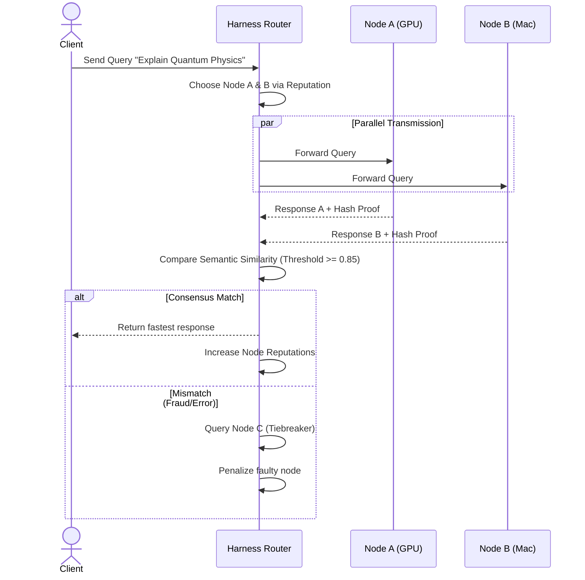

# iToken (Decentralized Processing Unit) — Detailed Implementation Plan v2 (English)

> Fusing P2P Networking, Decoupled LLM APIs, and a Sovereign Ledger (iToken) for Decentralized AI Inference.

---

## 0. Core Architectural Decisions

### 🔴 Python will not be used for the Core Daemon
After careful evaluation, building the core P2P daemon in Python was rejected due to:
*   **Large Binaries:** 50–150 MB packaging size (PyInstaller).
*   **High Memory Overhead:** Garbage collector + interpreter footprint.
*   **GIL (Global Interpreter Lock):** Incapable of high-concurrency async P2P routing.
*   **Immature libp2p bindings:** Python's libp2p implementation is deprecated/unmaintained.
*   **AV False Positives:** PyInstaller executables trigger Windows Defender frequently.

### ✅ Selected Stack: Rust Core Daemon + Decoupled Local LLM APIs

```
┌──────────────────────────────────────────────────┐
│        P2P Daemon (Rust — tokio + rust-libp2p)   │
│  ┌──────────┐  ┌─────────────┐  ┌────────────┐  │
│  │ libp2p   │  │ Gossipsub   │  │ Ledger     │  │
│  │ • QUIC   │  │ • Capability│  │ • Blocks   │  │
│  │ • NAT    │  │ • Peer Score│  │ • Tx       │  │
│  │ • DHT    │  │ • Heartbeat │  │ • Escrow   │  │
│  └──────────┘  └─────────────┘  └────────────┘  │
│  ┌─────────────────────────────────────────────┐ │
│  │   Harness Router (Consensus & Routing)      │ │
│  └─────────────────────────────────────────────┘ │
│  ┌─────────────────────────────────────────────┐ │
│  │   API Auto-Detection & Proxy (OpenAI API)   │ │
│  └─────────────────────────────────────────────┘ │
└──────────────────────────────┬───────────────────┘
                               │ Local HTTP / REST (OpenAI Compatible)
                               │ (e.g., http://localhost:11434, 1234)
┌──────────────────────────────▼───────────────────┐
│        External Local LLM Inference Engines      │
│  ┌─────────────────┐ ┌─────────────┐ ┌─────────┐  │
│  │ LM Studio       │ │ Ollama      │ │ vLLM    │  │
│  └─────────────────┘ └─────────────┘ └─────────┘  │
│  ┌─────────────────┐ ┌─────────────┐ ┌─────────┐  │
│  │ llama-server    │ │ Kobold.cpp  │ │ Others  │  │
│  └─────────────────┘ └─────────────┘ └─────────┘  │
└──────────────────────────────────────────────────┘
```

**Key Advantages:**
1.  **Rust Daemon:** Extremely small binary footprint, low memory usage, compile-time thread safety, and zero garbage collection spikes.
2.  **Decoupled API (Simple is Best):** Leverages existing tools (Ollama, LM Studio) that already solve GPU optimization (CUDA, Metal, Vulkan) and quantization. The iToken daemon acts as a lightweight P2P reverse proxy.
3.  **Port Auto-Discovery:** Probes standard ports (11434, 1234, 8080) to dynamically register running models in the DHT. Supports manual override IP/Port (`http://192.168.0.5:12345`).

---

## 1. Hardware Compatibility Matrix

### 1.1 Target Devices & Backends (Supported via External Engines)

| Hardware | VRAM / Memory | Inference Backend | Max Model Size (Q4) | Note |
|:---|:---|:---|:---|:---|
| **RTX Spark** | 128 GB Unified | CUDA | 70B+ | Blackwell SoC, ARM-based Unified Memory |
| **RTX 4090** | 24 GB | CUDA | 30–32B | Premier consumer GPU |
| **RTX 3090** | 24 GB | CUDA | 30–32B | Cost-effective mainstream choice |
| **RTX 3080** | 10 GB | CUDA | 8B | Good for smaller models |
| **GTX 1080** | 8 GB | CUDA | 8B (Q4) | Legacy CUDA, no tensor cores |
| **Mac Mini M4** | 32 GB Unified | Metal | 14B | Low-power, always-on candidate |
| **Mac Mini M2 Pro** | 32 GB Unified | Metal | 14B | Highly stable Metal performance |
| **Mac Pro M2 Ultra** | 192 GB Unified | Metal | 70B+ | Capable of hosting massive models |
| **RX 7900 XTX** | 24 GB | Vulkan / ROCm | 30–32B | Top-tier AMD card |
| **CPU Only (Intel/AMD)** | System RAM | CPU (AVX2/AVX512) | Dependent on RAM | Universal fallback |

### 1.2 Model Memory Requirements (Q4_K_M Quantization)

| Model | Parameter Size | Q4 Size | Q8 Size | F16 Size |
|:---|:---|:---|:---|:---|
| Llama 3 8B | 8B | ~5 GB | ~9 GB | ~16 GB |
| Mistral 7B | 7B | ~4.5 GB | ~8 GB | ~14 GB |
| Qwen 2.5 32B | 32B | ~18 GB | ~34 GB | ~64 GB |
| Llama 3 70B | 70B | ~38 GB | ~72 GB | ~140 GB |

---

## 2. P2P Network Architecture (Scaling to Volunteer Size)

### 2.1 P2P Protocol Stack (libp2p)
*   **Transport:** QUIC (Default) over UDP. Low-latency, 0-RTT reconnection, connection migration (keeps connection active when switching IP/Wi-Fi).
*   **Discovery:** Kademlia DHT for O(log n) node capability routing. Nodes advertise their running models as DHT keys.
*   **NAT Traversal:** 3-step automatic traversal: AutoNAT (detect status) -> DCUtR (UDP hole punching via relay) -> Circuit Relay v2 (backup relay proxy).

---

## 3. Harness Routing Strategy

### 3.1 1-Query-1-Node Routing (Optimistic Path)
For maximum efficiency and power saving, the default execution path routes **1 query to exactly 1 node** based on Reputation and Staking.
*   If the node succeeds, it gets paid and its reputation increases.
*   If the node cheats or fails, the **Optimistic Challenger** mechanism is activated (see Section 4.3), slashing the node's stake.

### 3.2 Consensus Mode (2-Node Double-Checking)
Under high-security mode or for random sampling (e.g., 1% of queries):



---

## 4. Sovereign Ledger & iToken Tokenomics

### 4.1 Ledger Independence
To remain completely independent of external market crashes (Bitcoin, Ethereum), the network runs a **Substrate-based Solo Chain**. This guarantees sovereign consensus, gas-less state channel microtransactions, and custom slashing logic.

### 4.2 iToken Compensation Formula (TPS & GPU Scaling)
Inference compensation is calculated dynamically, factoring in **Model Quality** ($TQW$) and **Relative Generation Speed** ($TPS\text{ Multiplier}$).

$$\text{iToken Reward} = \text{Generated Tokens} \times TQW_{M, Q} \times \text{Speed Multiplier}(TPS)$$

*   **$TQW_{M, Q}$ (Token Quality Weight):** Decays dynamically over time relative to global benchmarks (MMLU-Pro) and decreasing market bid volume (preventing inflation of legacy models).
*   **$\text{Speed Multiplier}(TPS)$ (Dynamic Speed Factor):** Calculated relative to the network's moving median speed for that model class:
    $$\text{Speed Multiplier}(TPS_{node}) = \left( \frac{TPS_{node}}{TPS_{network\_moving\_median}} \right)^\gamma$$
    *   **GPU Nodes (e.g., 50 TPS):** Speed multiplier > 1.0. Fast, real-time responses earn higher rates.
    *   **CPU Nodes (e.g., 5 TPS):** Speed multiplier < 0.2. Slower batch outputs are heavily discounted.
    *   **Market Separation:** Fast GPU nodes serve real-time API requests with minimum TPS thresholds. Slower CPU nodes bid for batch offline tasks (e.g., bulk translations) on the orderbook.

### 4.3 Verification Consensus (Optimistic Challenger)
Instead of forcing expensive continuous verification (like VeriLLM) on all queries, iToken uses an **Optimistic Challenger Model**:

```
┌───────────────────────────────────────────────────────────────────────┐
│               [ iToken Layered Verification System ]                     │
├───────────────────────────────────────────────────────────────────────┤
│  Level 1: Semantic Embedding Agreement (Lightweight)                  │
│  • Compares response embeddings using a 300MB MiniLM model (>=0.85).  │
├───────────────────────────────────────────────────────────────────────┤
│  Level 2: Green Watermark Verification                                │
│  • Modifies token probability slightly based on a PRNG seed.          │
│  • Validators verify the output watermark without running the model.   │
├───────────────────────────────────────────────────────────────────────┤
│  Level 3: Silent Challenge Queries                                    │
│  • Randomly injects test queries with pre-calculated answers.         │
├───────────────────────────────────────────────────────────────────────┤
│  Level 4: Optimistic Challenger Slashing (Final Arbitration)          │
│  • Active verification overhead is 0% under normal operation.         │
│  • If a client files a dispute (stakes iToken), a validator runs a   │
│    VeriLLM check (IEEE 754 exponent/mantissa drift analysis).         │
│  • Fraudulent nodes lose their staked iTokens, which go to the        │
│    challenger. Cheating nodes are blacklisted.                        │
└───────────────────────────────────────────────────────────────────────┘
```

---

## 5. File Structure & PoC Blueprint

```
d:/Code/iToken/
├── Cargo.toml                    # Workspace manifest
├── README.md                     # Repository overview (English)
├── README_KR.md                  # Repository overview (Korean)
│
├── crates/
│   ├── itoken-core/                 # Shared types, cryptographic keys, signatures
│   ├── itoken-network/              # libp2p + QUIC + Kademlia DHT routing
│   ├── itoken-inference/            # OpenAI API proxy, Port Scanner, and Tokenizer
│   │   └── src/
│   │       ├── lib.rs
│   │       ├── detector.rs       # Auto-scans local ports (11434, 1234, etc.)
│   │       ├── proxy.rs          # Proxies P2P requests <-> local HTTP APIs
│   │       └── proof.rs          # Signs compute receipts and measures TPS
│   ├── itoken-harness/              # Harness routing, reputation metrics, failover
│   └── itoken-ledger/               # Substrate solo chain / lightweight PoC ledger
```

---

## Open Questions

> [!WARNING]
> **Regulatory / Security compliance:** Staking and launching a sovereign utility token (iToken) is subject to financial regulations in many jurisdictions (such as South Korea's Virtual Asset User Protection Act). Legal compliance should be reviewed before public mainnet launch.
